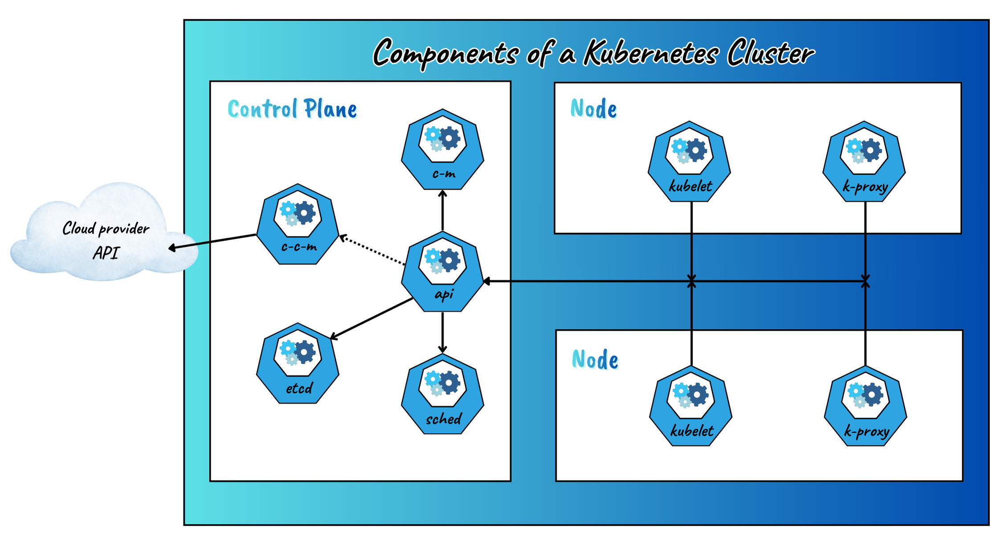
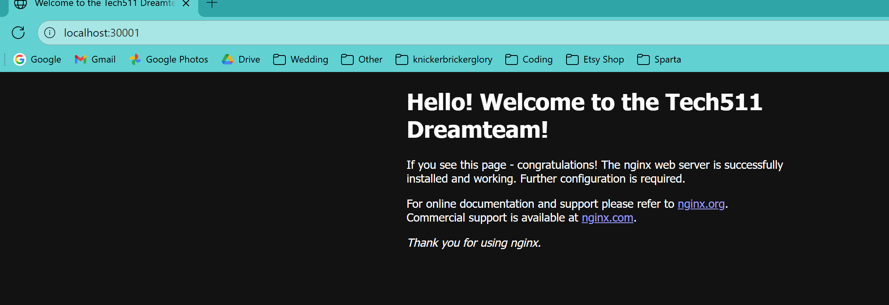
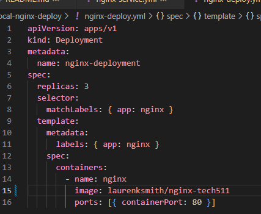

# Use Kubernetes for 2-Tier App Deployment

- [Use Kubernetes for 2-Tier App Deployment](#use-kubernetes-for-2-tier-app-deployment)
  - [Overview](#overview)
  - [Research](#research)
    - [Why Kubernetes is Needed](#why-kubernetes-is-needed)
    - [Benefits of Kubernetes](#benefits-of-kubernetes)
    - [Success Stories](#success-stories)
    - [Kubernetes Architecture](#kubernetes-architecture)
    - [The Cluster Setup](#the-cluster-setup)
      - [What is a Cluster?](#what-is-a-cluster)
      - [Master vs Worker Nodes](#master-vs-worker-nodes)
      - [Pros and Cons of Using Managed Service vs Launching Your Own](#pros-and-cons-of-using-managed-service-vs-launching-your-own)
      - [Control Plane vs Data Plane](#control-plane-vs-data-plane)
    - [Kubernetes Objects](#kubernetes-objects)
      - [Most Common Kubernetes Objects](#most-common-kubernetes-objects)
      - [Ephemeral Pods](#ephemeral-pods)
    - [How to Mitigate Security Concerns with Containers](#how-to-mitigate-security-concerns-with-containers)
    - [Maintained Images](#maintained-images)
      - [What They Are](#what-they-are)
      - [Pros and Cons of Using Maintained Images for Your Base Container Images](#pros-and-cons-of-using-maintained-images-for-your-base-container-images)
    - [Types of Autoscaling in Kubernetes](#types-of-autoscaling-in-kubernetes)
    - [1. Horizontal Pod Autoscaler (HPA)](#1-horizontal-pod-autoscaler-hpa)
      - [How it works](#how-it-works)
      - [Example](#example)
      - [Use Cases](#use-cases)
      - [Key Benefit](#key-benefit)
    - [2. Vertical Pod Autoscaler (VPA)](#2-vertical-pod-autoscaler-vpa)
      - [How it works](#how-it-works-1)
      - [Example](#example-1)
      - [Use Cases](#use-cases-1)
      - [Key Benefit](#key-benefit-1)
    - [3. Cluster Autoscaler (CA)](#3-cluster-autoscaler-ca)
      - [How it works](#how-it-works-2)
      - [Example](#example-2)
      - [Use case](#use-case)
      - [Key benefit](#key-benefit-2)
  - [Create and Test Nginx Deployment with NodePort Service](#create-and-test-nginx-deployment-with-nodeport-service)
    - [What I Did](#what-i-did)
    - [Why This Step Matters](#why-this-step-matters)
  - [Deleting a Pod](#deleting-a-pod)
    - [What I Did](#what-i-did-1)
    - [Why This Step Matters](#why-this-step-matters-1)
  - [Increasing Replicas with No Downtime](#increasing-replicas-with-no-downtime)
    - [What I Did](#what-i-did-2)
    - [Why This Step Matters](#why-this-step-matters-2)
  - [Deleting Kubernetes Deployments and Services](#deleting-kubernetes-deployments-and-services)
    - [What I Did](#what-i-did-3)
    - [Why This Step Matters](#why-this-step-matters-3)
  - [Kubernetes Deployment of NodeJS Sparta Test App](#kubernetes-deployment-of-nodejs-sparta-test-app)
    - [What I Did](#what-i-did-4)
    - [Why This Step Matters](#why-this-step-matters-4)
  - [Two-Tier Deployment with Persistent Volume for Database](#two-tier-deployment-with-persistent-volume-for-database)
    - [What I Did](#what-i-did-5)
    - [My Kubernetes Architecture with Persistent Volume Diagram](#my-kubernetes-architecture-with-persistent-volume-diagram)
    - [Why This Step Matters](#why-this-step-matters-5)
  - [Scaling the App using Horizontal Pod Autoscaler (HPA)](#scaling-the-app-using-horizontal-pod-autoscaler-hpa)
    - [What I Did](#what-i-did-6)
    - [Why This Step Matters](#why-this-step-matters-6)
  - [Setting Up Minikube on an AWS Cloud Instance (Ubuntu 22.04 LTS)](#setting-up-minikube-on-an-aws-cloud-instance-ubuntu-2204-lts)
    - [What I Did](#what-i-did-7)
  - [](#)
  - [Deploy Three Apps on One Cloud Instance Running Minikube](#deploy-three-apps-on-one-cloud-instance-running-minikube)
    - [App 1 – NodePort Deployment](#app-1--nodeport-deployment)
      - [What I Did](#what-i-did-8)
      - [Why This Step Matters](#why-this-step-matters-7)
    - [App 2 – LoadBalancer Deployment](#app-2--loadbalancer-deployment)
      - [What I Did](#what-i-did-9)
      - [Why This Step Matters](#why-this-step-matters-8)
    - [App 3 – hello-minikube Deployment](#app-3--hello-minikube-deployment)
      - [What I Did](#what-i-did-10)
      - [Why This Step Matters](#why-this-step-matters-9)
    - [Cleanup and Restart Guide](#cleanup-and-restart-guide)
      - [What I Did](#what-i-did-11)
      - [Why This Step Matters](#why-this-step-matters-10)
  - [Use Kubernetes to Deploy the Sparta Test App in the Cloud](#use-kubernetes-to-deploy-the-sparta-test-app-in-the-cloud)
    - [What I Did](#what-i-did-12)
  - [Websites Used/Looked At](#websites-usedlooked-at)
    - [Understanding Kubernetes](#understanding-kubernetes)
    - [Kubernetes Architecture](#kubernetes-architecture-1)
    - [Replicas](#replicas)
    - [Delete Resources](#delete-resources)
    - [Adding the Database](#adding-the-database)
    - [Maintained Docker Image for Database](#maintained-docker-image-for-database)
    - [Seeding the Database](#seeding-the-database)
    - [MongoDB Secrets](#mongodb-secrets)
    - [Persistent Volumes](#persistent-volumes)
    - [Autoscaling with Kubernetes](#autoscaling-with-kubernetes)
    - [Minikube](#minikube)

## Overview

## Research

### Why Kubernetes is Needed
As applications grow and become more complex, running them across multiple servers manually becomes difficult to manage. Kubernetes solves this by automating deployment, scaling, and management of containerised applications. It ensures that applications run reliably, even when there are hardware failures or traffic spikes. Essentially, it removes much of the manual work involved in keeping systems running smoothly, making deployments faster, more consistent, and easier to control at scale.

### Benefits of Kubernetes
- **Scalability**: Kubernetes can automatically increase or decrease the number of containers running depending on demand.

- **Self-healing**: If a container fails or a node goes down, Kubernetes detects it and replaces it automatically.

- **Portability**: It works the same way across different environments – from a laptop to cloud platforms such as AWS, Azure, or GCP.

- **Resource efficiency**: Kubernetes schedules workloads in a way that makes the best use of available resources.

- **Automation**: Updates, rollbacks, and configuration changes can be managed automatically without downtime.

- **Consistency**: Teams can deploy applications in the same way everywhere, avoiding “it works on my machine” issues!
  
### Success Stories
- **Spotify**:
<br> Spotify uses Kubernetes to manage THOUSANDS of backend services which support its music streaming platform. This improves their scalability as well as the deployment speed.
- **NASA**:
<br> NASA adopted Kubernetes to process massive amounts of space mission data efficiently, and reliably.
- **The New York Times**:
<br> The NY Times migrated its entire digital archive to Kubernetes. This made it easier for them to scale and maintain their content services.

### Kubernetes Architecture
The Kubernetes architecture follows a control-plane and data-plane model.
The Control Plane is responsible for managing the overall state of the cluster — deciding what should run and maintaining the desired configuration. It includes components such as the API Server, etcd (cluster database), Scheduler, and Controller Manager.
The Data Plane consists of the worker nodes that actually run the application workloads. Each node runs a kubelet (which manages containers on that node) and a kube-proxy (which handles networking).

The diagram below shows the key components of a Kubernetes cluster and how they interact:



**Brief explanation of each component in the above diagram**:<br>
1. api = Api Server. Entry point for all communication
2. etcd = Persistance Store. Stores the cluster's state and configuration
3. sched = Scheduler. Decides where pods should run
4. c-m = Controller Manager. Ensures system health and restarts pods if needed
5. c-c-m = Cloud Controller Manager. Integrates with external cloud providers
6. Kubelet. Ensures containers are running properly
7. k-proxy = Kube-Proxy. Routes network traffic between pods and services


This design allows Kubernetes to balance control and automation — the control plane handles decisions and coordination, while the data plane performs the work of running containers.

### The Cluster Setup

#### What is a Cluster?
A Kubernetes cluster is a group of physical or virtual machines that operate together as one system to run and manage containerised applications.
It’s made up of a control plane, which oversees and coordinates the cluster, and a set of worker nodes, where the applications themselves run.
This architecture is what allows Kubernetes to handle important operational tasks — such as scheduling, scaling, and updates — automatically and consistently.

#### Master vs Worker Nodes
A Kubernetes cluster is made up of two main types of nodes:
- **Control Plane Nodes** (formerly known as Master Nodes) – These manage and coordinate the cluster. They handle scheduling, scaling, and monitoring, and maintain the desired state of the system.
- **Worker Nodes** – These run the actual applications and services. Each worker node contains the necessary components to host containers and communicate with the control plane.

Together, the control plane nodes provide intelligence and decision-making, while the worker nodes provide the computing power.
  
#### Pros and Cons of Using Managed Service vs Launching Your Own
| Approach                                            | Pros                                                                                                                                                                      | Cons                                                                                                                               |
| --------------------------------------------------- | ------------------------------------------------------------------------------------------------------------------------------------------------------------------------- | ---------------------------------------------------------------------------------------------------------------------------------- |
| **Managed Service (e.g., AWS EKS, Azure AKS, GKE)** | - Easy setup and maintenance (cloud provider manages updates and control plane).<br>- Integrated security and monitoring tools.<br>- Scales easily with less manual work. | - Can be more expensive long-term.<br>- Less control over underlying infrastructure.<br>- Dependent on provider’s update schedule. |
| **Self-Managed (Launch Your Own)**                  | - Full control and customisation of setup.<br>- Can be cost-effective for small or on-prem clusters.<br>- Good for learning and experimentation.                          | - Requires more hands-on management and troubleshooting.<br>- Responsibility for updates, security patches, and scaling.           |

#### Control Plane vs Data Plane
- **Control Plane**: The brain of the cluster — it makes global decisions such as scheduling, scaling, and monitoring the overall state. It includes the API Server, Scheduler, Controller Manager, and etcd database.
- **Data Plane**: The muscle of the cluster — this is where the applications actually run. It consists of worker nodes, each with a kubelet and kube-proxy.

### Kubernetes Objects
Kubernetes represents everything it manages as an object.
An object is simply a record of your intended state for a part of the system — for example, which containers should be running, how many replicas you want, or how to expose an application.
When you apply a YAML manifest, Kubernetes reads it as an object definition and ensures the system matches it.

#### Most Common Kubernetes Objects
- **Pod**: The smallest deployable unit — usually one or more containers that share storage, network, and configuration.
- **ReplicaSet**: Ensures the correct number of Pod replicas are running at any time.
- **Deployment**: A higher-level object that manages ReplicaSets and provides rolling updates and rollbacks.
- **Service**: Exposes Pods internally or externally so other parts of the system (or users) can reach them.
- **ConfigMap** and **Secret**: Store configuration data and sensitive information like passwords separately from the container images.
- **PersistentVolume** (PV) and **PersistentVolumeClaim** (PVC): Handle storage so data can survive even if Pods are deleted.

#### Ephemeral Pods
Pods are considered **ephemeral**, which means that they are temporary and not designed to last forever. If a pod fails or a node goes down, Kubernetes will create a new pod to replace it. Any data that was stored inside the pod’s container will be lost unless it’s linked to a persistent storage volume. With the pods being ephemeral, Kubernetes is able to focus on resilience and uptime — individual pods might come and go, but the app will remain available.

### How to Mitigate Security Concerns with Containers
Here are some ways I discovered online to mitigate possible security concerns that users might have in regards to containers:
- Make sure you use base images from verified sources to reduce the risk of vulnerabilities.
- Regularly scan images for outdated packages or known exploits.
- Run containers as non-root users where possible.
- Limit permissions and isolate workloads using namespaces and network policies.
- Keep credentials out of images, using Kubernetes Secrets or environment variables instead.
- Apply resource limits (CPU, memory) to prevent resource exhaustion attacks.

### Maintained Images

#### What They Are
A maintained image is a Docker image that is regularly updated and supported, often by the organisation that develops the underlying software (for example, `nginx:latest` or `mongo:7`).
Because these images receive frequent security patches and version updates, the need to manage them manually is reduced.

#### Pros and Cons of Using Maintained Images for Your Base Container Images

| Pros                                                                 | Cons                                                                           |
| -------------------------------------------------------------------- | ------------------------------------------------------------------------------ |
| ✅ Receive regular security updates and bug fixes.                    | ❌ Updates can sometimes introduce changes that affect or even break your app.      |
| ✅ Saves time — no need to build and maintain everything from scratch. | ❌ You have to rely on the maintainer’s update schedule and trust their build process. |
| ✅ Provides consistency and stability across environments.             | ❌ Limited flexibility if you need heavy customisation.                        |

### Types of Autoscaling in Kubernetes
Kubernetes provides a few different types of autoscaling that help ensure applications run efficiently as well as cost-effectively by automatically adjusting resources depending on demand. Autoscaling allows the cluster to respond dynamically to changes in workload: scaling applications up when there is higher demand and back down when demand decreases.

There are 3 main types of autoscaling in Kubernetes:

### 1. Horizontal Pod Autoscaler (HPA)
The **Horizontal Pod Autoscaler** automatically scales the number of pod replicas in a deployment (or replica set) based on observed CPU/memory usage or other custom metrics.

#### How it works
- HPA monitors metrics, such as CPU utilisation or request latency, through the Kubernetes Metrics Server (KMS).  
- When usage exceeds a defined threshold, the HPA increases replicas; when usage drops, it reduces them.  
- Scaling happens gradually to maintain stability and avoid sudden resource changes.

#### Example

```bash
kubectl autoscale deployment sparta-app-deploy --cpu-percent=70 --min=3 --max=10
```

#### Use Cases
HPA is ideal for stateless workloads, where multiple replicas can run independently behind a service.

#### Key Benefit
HPA ensures application responsiveness under load while at the same time minimising unused compute during quiet periods.

### 2. Vertical Pod Autoscaler (VPA)
The Vertical Pod Autoscaler adjusts the resource requests and limits (CPU and memory) of containers inside pods rather than changing the number of replicas.

#### How it works
- VPA monitors actual resource usage over time.
- It recommends or automatically updates CPU and memory settings for running pods.
- It may restart pods to apply new resource settings, so it’s often used for less latency-sensitive workloads.

#### Example

```bash
kubectl apply -f vpa.yaml
```

#### Use Cases
VPA is useful for stateful workloads like MongoDB or apps with unpredictable memory needs that don’t scale well horizontally.

#### Key Benefit
VPA optimises pod performance and cluster efficiency by giving each container the exact amount of resources it needs.

### 3. Cluster Autoscaler (CA)
The Cluster Autoscaler operates at the infrastructure level — automatically adjusting the number of nodes in a cluster based on overall resource demand.

#### How it works
When pods cannot be scheduled due to insufficient node resources, the Cluster Autoscaler provisions additional nodes. When nodes are underutilised and their pods can be moved elsewhere, it scales the cluster back down.

#### Example
- CA is commonly used in managed Kubernetes environments like AWS EKS, Google GKE, or Azure AKS.
- Configuration of CA normally happens in the cloud provider console or through Terraform, rather than a simple YAML manifest.

#### Use case
CA is perfect for ensuring the entire cluster has enough capacity to support scaling workloads, without manual intervention.

#### Key benefit
CA balances cost vs performance by ensuring you only pay for the infrastructure you actually need.

## Create and Test Nginx Deployment with NodePort Service
For this step, I deployed an Nginx web server in Kubernetes using a Deployment and a NodePort Service.  
The goal was to run multiple replicas of Nginx and expose them externally via a port on my local machine.  
To make it more personal and visually distinct, I used my own **custom Nginx image** (`laurenksmith/nginx-tech511`) that I had previously pushed to Docker Hub.  
This image includes a modified `index.html` file, so when accessed in the browser, it displays my own version of the Nginx front page.

### What I Did

1. **Enabled Kubernetes in Docker Desktop**

   - In Docker Desktop, I went to to the Kubernetes menu (found on the tab on the left), chose 'Enable Kubernetes', kept the settings as it was and then waited for the cluster to be created.
  
   - I then verified it was running by going to Bash and typing:

     ```bash
     kubectl get svc
     ```

     The output confirmed that the Kubernetes cluster was active:

     ```
     NAME         TYPE        CLUSTER-IP    EXTERNAL-IP   PORT(S)   AGE
     kubernetes   ClusterIP   10.96.0.1     <none>        443/TCP   3m56s
     ```

1. **Ensured I Was in my Repo Folder**

    - Using Bash, I cd'd into my repo folder (github/kubernetes-app-deployment)

2. **Created the Deployment YAML**

   - In my repo, I created a folder named `local-nginx-deploy/`.
   - Inside it, I added a file called `nginx-deploy.yml` with the following configuration:

     ```yaml
     apiVersion: apps/v1
     kind: Deployment
     metadata:
       name: nginx-deployment
     spec:
       replicas: 3
       selector:
         matchLabels:
           app: nginx
       template:
         metadata:
           labels:
             app: nginx
         spec:
           containers:
             - name: nginx
               image: laurenksmith/nginx-tech511
               ports:
                 - containerPort: 80
     ```

   - I applied it using:

     ```bash
     kubectl apply -f local-nginx-deploy/nginx-deploy.yml
     ```

   - To check it was running correctly, I used:

     ```bash
     kubectl get deploy,rs,pod -l app=nginx
     ```

   This showed three pods in the **Running** state.

3. **Created the NodePort Service**

   - I then created a file called `nginx-service.yml` in the same folder with the following configuration:

     ```yaml
     apiVersion: v1
     kind: Service
     metadata:
       name: nginx-svc
     spec:
       type: NodePort
       selector:
         app: nginx
       ports:
         - port: 80
           targetPort: 80
           nodePort: 30001
     ```

   - I applied it using:

     ```bash
     kubectl apply -f local-nginx-deploy/nginx-service.yml
     kubectl get svc nginx-svc
     ```

   - Once it was running, I tested it by visiting http://localhost:30001 in my browser.

   - The custom Nginx welcome page that I had previously created and built into my Docker image appeared successfully — confirming that my image was being used correctly by the Kubernetes deployment.



4. **Verification and Testing**

   - I also viewed all resources together using:

     ```bash
     kubectl get all -l app=nginx
     ```

     This displayed the deployment, replicasets, and pods, showing that all three replicas were running and connected to the NodePort Service.

   - Finally, I confirmed visually in Docker Desktop’s Kubernetes section that the three Nginx pods were active.

### Why This Step Matters
This step demonstrated how Kubernetes can:

- Deploy multiple replicas of a containerised web server.
- Maintain availability and consistency across all replicas.
- Expose internal services externally using a NodePort.
- Seamlessly use my own Docker Hub image (`laurenksmith/nginx-tech511`).

From a personal perspective, I liked that I could **see my own customised Nginx front page** running across all pods — a small detail that made the deployment feel much more real and rewarding to complete.

## Deleting a Pod
This task demonstrated how Kubernetes automatically maintains the desired state of a deployment — a process known as *self-healing*.  
In my case, I used my running **nginx-deployment** (with three replicas) to see what happens when one of its pods is deleted.

### What I Did

1. First, I confirmed the three Nginx pods were running:

   ```bash
   kubectl get pods -l app=nginx

2. I then deleted one of the pods manually using its name from the list:

   ```bash
   kubectl delete pod nginx-deployment-85f9bdf8ff-2275x
   ```

3. After deleting it, I ran the same command again to list the pods:

   ```bash
   kubectl get pods -l app=nginx
   ```


   The output showed that there were three pods running again, and one of them had only just been created a few seconds earlier — confirming that Kubernetes had automatically started a replacement pod.

### Why This Step Matters
- This simple test showed one of Kubernetes’ most valuable features: if a pod fails, is deleted, or just stops responding, Kubernetes will immediately detect the issue and create a new pod to take its place.
- This built-in self-healing feature is what helps to ensure high availability and consistency, without any manual intervention.

## Increasing Replicas with No Downtime
This task demonstrated how Kubernetes allows us to scale a deployment in real time — increasing the number of Pods without interrupting service or causing downtime.  
I used my existing **nginx-deployment**, which was initially running three replicas, and scaled it up using three different methods.

### What I Did

1. **Checked the Current Deployment**
   Before starting, I verified that the deployment was running three replicas:
   ```bash
   kubectl get deploy/nginx-deployment
   ```


2. **Method 1 – Edit the Live Deployment**

   * I opened the live deployment directly using:

     ```bash
     kubectl edit deploy/nginx-deployment
     ```

   * In the editor that opened, I changed the replicas count from **3** to **4**:

     ```yaml
     spec:
       replicas: 4
     ```


   * After saving, I confirmed that the deployment had updated successfully:

     ```bash
     kubectl get deploy/nginx-deployment
     ```


3. **Method 2 – Apply a Modified YAML File**

   * I then opened my deployment YAML file (`local-nginx-deploy/nginx-deploy.yml`) and changed the replicas value to **5** (line 6):

     ```yaml
     spec:
       replicas: 5
     ```



   * I saved the file and applied the change without deleting the existing deployment:

     ```bash
     kubectl apply -f local-nginx-deploy/nginx-deploy.yml
     ```
   * I verified the update again:

     ```bash
     kubectl get deploy/nginx-deployment
     ```


4. **Method 3 – Use the kubectl Scale Command**

   * Finally, I used the scale command to increase replicas from **5** to **6**:

     ```bash
     kubectl scale deploy/nginx-deployment --replicas=6
     ```
   * I then ran:

     ```bash
     kubectl get deploy/nginx-deployment
     ```

     to confirm the deployment had scaled again successfully.


5. **Verified All Pods Were Running**

   * I listed all the Pods and ReplicaSets to confirm six Pods were now running across the same node and that all were healthy and available. This also showed the age of each pod:

     ```bash
     kubectl get deploy,rs,pod -l app=nginx -o wide
     ```


### Why This Step Matters
- This task showed me how Kubernetes allows you to scale applications dynamically without downtime.
- I was able to increase the number of Pods in my deployment three different ways: 
  - by editing the live configuration 
  - re-applying the YAML file
  - using a direct scale command
- In each case, Kubernetes automatically created new Pods while keeping the application running, proving how reliable and flexible the system is for real-time scaling.

## Deleting Kubernetes Deployments and Services
This step focused on cleaning up the Kubernetes resources I had created for my Nginx deployment.  
The goal was to delete both the deployment and service using the YAML manifest files I had originally applied, and then confirm that all related replicasets and pods had been removed.

### What I Did

1. From my project directory, I ran the following commands to delete the service and deployment:

   ```bash
   kubectl delete -f local-nginx-deploy/nginx-service.yml
   kubectl delete -f local-nginx-deploy/nginx-deploy.yml
   ```

Kubernetes confirmed that both resources were successfully deleted from the default namespace.


2. I then verified that everything had been removed — including the replicasets and pods — by running:

   ```bash
   kubectl get deploy,svc -l app=nginx
   kubectl get rs,pod -l app=nginx
   ```

   Both commands returned **“No resources found in default namespace”**, confirming a complete cleanup.

   

### Why This Step Matters
- Cleaning up unused resources is an important part of cluster management.
It prevents unnecessary resource usage and keeps the environment tidy for the next deployment.
- This helped me to understand how to **delete Kubernetes objects using their YAML manifests** and verify that all associated components (replicasets and pods) are also removed automatically.

## Kubernetes Deployment of NodeJS Sparta Test App
This step focused on automating the database seeding process for my Sparta Node app using a **Kubernetes Job**.  The goal was to populate the MongoDB database automatically so that the `/posts` page would display seeded data instead of appearing empty.

### What I Did

1. First, I made sure Kubernetes and MongoDB were both running:
   ```bash
   kubectl config use-context docker-desktop
   kubectl get nodes
   kubectl apply -f k8s-yaml-definitions/local-two-tier-db/mongo-deploy.yml
   kubectl apply -f k8s-yaml-definitions/local-two-tier-db/mongo-svc.yml
   ```

This confirmed that my Mongo deployment and service (`mongo-deploy` and `mongo-svc`) were active and ready for connections.

2. I then created a new YAML file named **`seed-db.yml`** to define a short-lived Kubernetes Job that would run my seed script once and then terminate.

   ```yaml
   apiVersion: batch/v1
   kind: Job
   metadata:
     name: seed-posts
   spec:
     backoffLimit: 0
     ttlSecondsAfterFinished: 300
     template:
       spec:
         restartPolicy: Never
         containers:
           - name: seeder
             image: laurenksmith/sparta-node-app:v1
             imagePullPolicy: IfNotPresent
             command: ["node", "seeds/seed.js"]
             env:
               - name: DB_HOST
                 value: "mongodb://mongo-svc:27017/posts"
   ```

   This configuration tells Kubernetes to run the `seed.js` file from my application image, using the same database connection string that my app uses.

3. Since Kubernetes Jobs are immutable, I deleted any previous version before applying the new one:

   ```bash
   kubectl delete job seed-posts --ignore-not-found
   kubectl apply -f k8s-yaml-definitions/local-two-tier-db/seed-db.yml
   ```

4. I then monitored the Job’s progress:

   ```bash
   kubectl get jobs
   kubectl logs job/seed-posts
   ```

   The logs showed that the script had successfully inserted the posts into the MongoDB collection.

  

1. Once the Job had completed, I verified that the `/posts` page was now populated by running:

   ```bash
   curl -i http://localhost:30010/posts
   ```

   and by visiting the page in my browser at `localhost:30010/posts`.

  

1. Finally, since the Job was configured with `ttlSecondsAfterFinished: 300`, it was automatically cleaned up five minutes after completion.

### Why This Step Matters
- This step demonstrated how **Kubernetes Jobs** can be used for short-lived, one-off tasks such as database seeding.
- It removed the need to manually access the app container and run the seed script, making the process fully **automated and repeatable**.
- It reinforced how Kubernetes handles not only continuous workloads (like Deployments) but also **temporary, task-based workloads** efficiently.
- Automating the seeding process ensures that the environment is consistent, reliable, and ready for testing or demonstration at any time.

## Two-Tier Deployment with Persistent Volume for Database
This step focused on furthering my understanding of two-tier Kubernetes deployment by introducing **persistent storage** for the MongoDB database.  
Previously, my database storage was ephemeral — meaning all data was lost whenever the Mongo pod was deleted.  
The goal here was to use **Persistent Volume (PV)** and **Persistent Volume Claim (PVC)** so that the database could retain data even after redeployments.

### What I Did

1. **Created a new deployment directory**
   - Inside my main `k8s-yaml-definitions` folder, I created a new subfolder named:  
     `local-two-tier-db-pv`
   - This kept my PV-based configuration separate from earlier deployments.

2. **Defined the Persistent Volume (PV)**
   - Created a YAML file `mongo-pv.yml` describing the persistent storage available to the cluster.
   - The PV used a **hostPath** (since I’m running Kubernetes locally through Docker Desktop).
   - My specifications:

     ```yaml
     apiVersion: v1
     kind: PersistentVolume
     metadata:
       name: mongo-pv
     spec:
       capacity:
         storage: 200Mi
       accessModes:
         - ReadWriteOnce
       hostPath:
         path: /var/lib/k8s/mongo-data
       persistentVolumeReclaimPolicy: Retain
     ```
   - The `Retain` policy ensured the data would remain available even if the PVC or Pod was deleted.

3. **Defined the Persistent Volume Claim (PVC)**
   - Created a second YAML file named `mongo-pvc.yml` to request that storage:

     ```yaml
     apiVersion: v1
     kind: PersistentVolumeClaim
     metadata:
       name: mongo-pvc
     spec:
       accessModes:
         - ReadWriteOnce
       resources:
         requests:
           storage: 200Mi
     ```

4. **Updated my MongoDB deployment**
   - I modified the existing `mongo-deploy.yml` to mount the PVC:

     ```yaml
     volumes:
       - name: mongo-storage
         persistentVolumeClaim:
           claimName: mongo-pvc
     containers:
       - name: mongo
         image: mongo:7
         ports:
           - containerPort: 27017
         volumeMounts:
           - name: mongo-storage
             mountPath: /data/db
     ```

5. **Deployed all resources**
   - From the project directory, I applied all YAML files:
     
     ```bash
     kubectl apply -f k8s-yaml-definitions/local-two-tier-db-pv/
     ```
   - Then I verified everything was running correctly:
     
     ```bash
     kubectl get pv
     kubectl get pvc
     ```
   - Both showed a **Bound** status, confirming the connection between the PV and PVC.
   - I used the curl command to print the posts page to my terminal, then verified once more by visiting the posts page in my browser window.


6. **Tested persistence**
   - I deleted the MongoDB Pod using:
     
     ```bash
     kubectl delete pod <mongo-pod-name>
     ```
   - Kubernetes automatically recreated a new pod, and when I refreshed my `/posts` page in the browser, the exact same seeded data was still there.
   - This confirmed the persistent volume was working correctly.


1. **Cleaned up resources**
   - When finished, I deleted the resources using:
     
     ```bash
     kubectl delete -f k8s-yaml-definitions/local-two-tier-db-pv/
     ```
   - I also checked that the PV and PVC were removed:
     ```bash
     kubectl get pv
     kubectl get pvc
     ```

### My Kubernetes Architecture with Persistent Volume Diagram


- **Sparta Node App (App Tier)**:  
  - 3 replicas via `sparta-app-deploy`  
  - Exposed through NodePort `sparta-app-svc` on port `30010 → 3000`  
  - Connects to MongoDB using `DB_HOST = mongodb://mongo-svc:27017/posts`

- **Mongo Database (Database Tier)**:  
  - 1 replica via `mongo-deploy`  
  - Internal `mongo-svc` (ClusterIP 27017)  
  - Seeded using the `seed-db` job  
  - Connected to a PVC (`mongo-pvc`) for persistent storage

- **Storage Layer**:  
  - `mongo-pvc` requests 200Mi and binds to `mongo-pv`  
  - `mongo-pv` uses `/var/lib/k8s/mongo-data` on the host  
  - `ReclaimPolicy: Retain` ensures data survives pod deletion  

### Why This Step Matters
- Introduced **data persistence** in my Kubernetes environment — ensuring that important application data survives restarts, redeployments, or crashes.  
- Reinforced my understanding of how **Persistent Volumes (PVs)** and **Persistent Volume Claims (PVCs)** interact with pods.  
- Provided hands-on experience with **mounting volumes inside containers** and managing Kubernetes storage lifecycles.

## Scaling the App using Horizontal Pod Autoscaler (HPA)
This step focused on implementing **Horizontal Pod Autoscaling (HPA)** in Kubernetes to automatically scale the number of application pods based on CPU utilisation. The aim was to ensure the Sparta Node app can handle varying workloads efficiently — scaling **out** when demand increases and **in** when demand decreases — without manual intervention.

### What I Did

1. **Installed the Metrics Server**  
  
   I began by deploying the Kubernetes Metrics Server, which collects CPU and memory usage data from each node and pod.  
   This data is required for the HPA to make scaling decisions.

   ```bash
   kubectl apply -f https://github.com/kubernetes-sigs/metrics-server/releases/latest/download/components.yaml
   ```

  Once deployed, I confirmed it was running and ready:

    ```bash
    kubectl get deploy metrics-server -n kube-system
    kubectl top nodes
    kubectl top pods
    ```

2. **Created the HPA**

   I applied a Horizontal Pod Autoscaler for the **sparta-app-deploy** Deployment.
   The configuration specified a minimum of 2 replicas and a maximum of 10, targeting 70% average CPU utilisation per pod.

   ```bash
   kubectl autoscale deployment sparta-app-deploy --min=2 --max=10 --cpu-percent=70
   ```

   I verified the HPA was active:

   ```bash
   kubectl get hpa
   ```

3. **Load Testing with Apache Bench (ab)**
   
   To simulate heavy traffic and test the autoscaling behaviour, I used **Apache Bench**, a simple HTTP benchmarking tool.
   I installed it locally and ran the following command from Command Prompt:

   ```bash
   "C:\Users\Public\Apache24\bin\ab.exe" -n 200000 -c 200 -k http://localhost:30010/
   ```

   
   
   - I first input the path where the **ab.exe** file, within Apache Bench, can be located on my local machine. 
   - `-n` defines the total number of requests (200,000).
   - `-c` sets the concurrency level (200 simultaneous users).
   - `-k` keeps connections alive for better performance simulation.

   While the test was running, I observed the autoscaler metrics in real time:

   ```bash
   kubectl get hpa -w
   kubectl get pods -l app=sparta-app -w
   kubectl top pods
   ```

4. **Monitoring Scaling Behaviour**
   
   During the load test, I watched the HPA adjust the number of running pods.
   CPU utilisation spiked temporarily, and Kubernetes automatically scaled the app from 2 replicas up to 3 and eventually up to 9, stabilising once the CPU returned to normal levels.

   

   I also used:

   ```bash
   kubectl describe hpa sparta-app-deploy
   ```

   to review scaling events and confirm that the autoscaler responded to changes in CPU usage.

### Why This Step Matters
- It demonstrates Kubernetes’ self-healing and self-scaling capabilities, improving efficiency and resilience.
- It ensures consistent performance during high-traffic periods without giving excess resources.
- It introduced me to metrics-driven automation, which I've learnt is essential for managing production-grade deployments.

## Setting Up Minikube on an AWS Cloud Instance (Ubuntu 22.04 LTS)
This step focused on setting up **Minikube** on an AWS EC2 instance running Ubuntu 22.04 LTS, to create a lightweight single-node Kubernetes cluster in the cloud.  
The aim was to get Kubernetes running on a remote server (rather than locally), so that I can later deploy, test, and manage clusters in a real cloud environment.

### What I Did

1. **Launched an AWS EC2 Instance**
   - **Instance type:** `t3a.small` (2 vCPUs, 2GB memory)  
   - **AMI:** Ubuntu Server 22.04 LTS  
   - **Storage:** Default  
   - **Security Group:**  
     - Port **22/tcp** - my IP (to SSH in)  
     - Ports **30000–32767/tcp** - my IP (Kubernetes default NodePort range)

I then launched and SSHd into my instance.

1. **Updated and Upgraded the System**
   Before installing anything, I made sure the instance was fully up to date:

   ```bash
   sudo apt update -y
   sudo apt upgrade -y
   ```

3. **Installed Docker**
   Since Minikube uses Docker as its default driver, I installed and enabled Docker on the instance:

   ```bash
   sudo apt install -y docker.io
   sudo systemctl enable docker
   sudo systemctl start docker
   sudo usermod -aG docker $USER
   ```

   Then I exited my instance `exit` and reconnected, which applied the user group changes.

   I confirmed Docker was running successfully:

   ```bash
   docker --version
   ```


---

4. **Installed Minikube**
   I downloaded and installed the latest Minikube binary directly from the official source:

   ```bash
   curl -LO https://storage.googleapis.com/minikube/releases/latest/minikube-linux-amd64
   sudo install minikube-linux-amd64 /usr/local/bin/minikube
   ```

   Then I verified the installation:

   ```bash
   minikube version
   ```

   The installation returned **v1.37.0**, confirming it was up to date.

  

5. **Started Minikube with Docker Driver**
   I used Docker as the driver and allocated the maximum available system memory for the cluster:

   ```bash
   minikube start --driver=docker
   ```

   During startup, Minikube automatically:

   - Pulled the base Kubernetes image
   - Configured a local control plane
   - Enabled the **storage-provisioner** and **default-storageclass** add-ons

   Despite a memory allocation warning, the cluster completed setup successfully.

   

## Deploy Three Apps on One Cloud Instance Running Minikube

### App 1 – NodePort Deployment
For this step, I deployed my **Sparta Test App** in Kubernetes using a Deployment and a NodePort Service.
The goal was to run the app within Minikube and expose it externally on my EC2 instance using port 80 through NGINX.
This app used the Docker image I had previously pushed to Docker Hub.

#### What I Did

1. **Ensured Minikube and Docker Were Running**

   - I checked the status of both Docker and Minikube:

     ```bash
     sudo systemctl start docker
     minikube start --driver=docker
     minikube status
     ```

     The output confirmed that both were running and the Minikube cluster was ready.

2. **Created Namespace**

   - I created a namespace to keep my resources organised:

     ```bash
     kubectl create namespace app1
     kubectl get ns
     ```

3. **Created the Deployment YAML**

   - In my working directory (`~/three-apps`), I created a file called `app1-deploy.yml` with the following configuration:

     ```yaml
     apiVersion: apps/v1
     kind: Deployment
     metadata:
       name: app1-deploy
       namespace: app1
     spec:
       replicas: 5
       selector:
         matchLabels:
           app: app1
       template:
         metadata:
           labels:
             app: app1
         spec:
           containers:
             - name: sparta-app
               image: laurenksmith/sparta-node-app
               ports:
                 - containerPort: 3000
     ```

   - I applied it using:

     ```bash
     kubectl apply -f app1-deploy.yml
     ```

   - To confirm it was running, I checked:

     ```bash
     kubectl get deploy,svc,pod -n app1
     ```

     This showed all five pods in the **Running** state.

4. **Created the NodePort Service**

   - I then created a file called `app1-svc.yml` with the following configuration:

     ```yaml
     apiVersion: v1
     kind: Service
     metadata:
       name: app1-svc
       namespace: app1
     spec:
       type: NodePort
       selector:
         app: app1
       ports:
         - port: 80
           targetPort: 3000
           nodePort: 30001
     ```

   - I applied it using:

     ```bash
     kubectl apply -f app1-svc.yml
     kubectl get svc -n app1
     ```

5. **Configured NGINX to Proxy Traffic**

   - I edited the NGINX configuration file:

     ```
     /etc/nginx/sites-available/default
     ```

     - Inside, I added the following configuration for App 1:

       ```nginx
       server {
           listen 80;
           server_name _;

           location / {
               proxy_pass http://192.168.49.2:30001;
               proxy_set_header Host $host;
               proxy_set_header X-Real-IP $remote_addr;
           }
       }
       ```

   - I tested and reloaded NGINX:

     ```bash
     sudo nginx -t
     sudo systemctl reload nginx
     ```

6. **Verification and Testing**

   - I verified that the deployment was accessible by visiting:

     ```
     http://<EC2_Public_IP>
     ```

   - The Sparta Test App loaded successfully, confirming that the NodePort and reverse proxy configuration worked as intended.

#### Why This Step Matters
This step demonstrated how to:

- Deploy an application on Kubernetes using a custom Docker image.
- Expose the app externally via a NodePort service.
- Configure NGINX to route requests to the correct internal Minikube IP and port.
- Maintain clean separation of resources using namespaces.

From a personal perspective, this was the first step where I saw my own deployed app running from inside a Kubernetes cluster, which made the setup feel very real and rewarding.

### App 2 – LoadBalancer Deployment
For this step, I deployed a second version of my app to demonstrate a **LoadBalancer Service**.
The goal was to emulate cloud-style load balancing using `minikube tunnel`, and to make this app accessible externally through port 9000 on my EC2 instance.

#### What I Did

1. **Created Namespace**

   - I created a new namespace for the second app:

     ```bash
     kubectl create namespace app2
     ```

2. **Created the Deployment YAML**

   - In my working directory (`~/three-apps`), I created a file called `app2-deploy.yml` with the following configuration:

     ```yaml
     apiVersion: apps/v1
     kind: Deployment
     metadata:
       name: app2-deploy
       namespace: app2
     spec:
       replicas: 1
       selector:
         matchLabels:
           app: app2
       template:
         metadata:
           labels:
             app: app2
         spec:
           containers:
             - name: sparta-app
               image: laurenksmith/sparta-node-app
               ports:
                 - containerPort: 3000
     ```

   - I applied it using:

     ```bash
     kubectl apply -f app2-deploy.yml
     ```

3. **Created the Service YAML**

   - I created another file called `app2-svc.yml`:

     ```yaml
     apiVersion: v1
     kind: Service
     metadata:
       name: app2-svc
       namespace: app2
     spec:
       type: LoadBalancer
       selector:
         app: app2
       ports:
         - port: 80
           targetPort: 3000
     ```

   * I applied it using:

     ```bash
     kubectl apply -f app2-svc.yml
     kubectl get svc -n app2
     ```

4. **Started the LoadBalancer Tunnel**

   - Because Minikube runs locally, I used the tunnel command to emulate an external load balancer:

     ```bash
     sudo -E minikube tunnel
     ```

   - This was run in a separate terminal to keep it active while testing.

5. **Updated NGINX Configuration**

   - I edited the NGINX configuration file again:

     ```
     /etc/nginx/sites-available/default
     ```

     - I added the following block:

       ```nginx
       server {
           listen 9000;
           server_name _;

           location / {
               proxy_pass http://192.168.49.2:30002;
               proxy_set_header Host $host;
               proxy_set_header X-Real-IP $remote_addr;
           }
       }
       ```

   - I tested and reloaded NGINX:

     ```bash
     sudo nginx -t
     sudo systemctl reload nginx
     ```

6. **Updated Security Group Rules**

   - I added an inbound rule to allow **TCP traffic on port 9000** from my IP address in the EC2 security group settings.

7. **Verification and Testing**

   - I verified the deployment using:

     ```bash
     curl -I http://localhost:9000
     ```

   - Finally, I opened my browser and visited:

     ```
     http://<EC2_Public_IP>:9000
     ```

     The app loaded successfully, showing that the LoadBalancer service was correctly proxied via NGINX.

#### Why This Step Matters
This step demonstrated how to:

- Use `minikube tunnel` to emulate a LoadBalancer service on a local or cloud-hosted Minikube cluster.
- Configure NGINX to route traffic to a different port (9000).
- Use EC2 security groups to allow controlled external access to specific services.

Personally, I found this step valuable as it helped me understand how cloud-style load balancing works even within a local Kubernetes setup.

### App 3 – hello-minikube Deployment

For this step, I deployed the official **hello-minikube** app from the Kubernetes documentation.
The goal was to run the sample echoserver container using a LoadBalancer service and expose it externally through NGINX at `/hello`.

#### What I Did

1. **Created Namespace**

   - I created a new namespace for the third app:

     ```bash
     kubectl create namespace app3
     ```

2. **Created the Deployment YAML**

   - I created a file called `app3-deploy.yml` in my working directory (`~/three-apps`) with the following configuration:

     ```yaml
     apiVersion: apps/v1
     kind: Deployment
     metadata:
       name: app3-deploy
       namespace: app3
     spec:
       replicas: 1
       selector:
         matchLabels:
           app: app3
       template:
         metadata:
           labels:
             app: app3
         spec:
           containers:
             - name: hello-minikube
               image: registry.k8s.io/echoserver:1.10
               ports:
                 - containerPort: 8080
     ```

   - I applied it using:

     ```bash
     kubectl apply -f app3-deploy.yml
     ```

3. **Created the Service YAML**

   - I then created a LoadBalancer service in `app3-svc.yml`:

     ```yaml
     apiVersion: v1
     kind: Service
     metadata:
       name: app3-svc
       namespace: app3
     spec:
       type: LoadBalancer
       selector:
         app: app3
       ports:
         - port: 8080
           targetPort: 8080
     ```

   - I applied it using:

     ```bash
     kubectl apply -f app3-svc.yml
     kubectl get svc -n app3 -w
     ```

   - Once the LoadBalancer had an **EXTERNAL-IP**, I noted it for the NGINX configuration.

4. **Started the LoadBalancer Tunnel**

   - I ran:

     ```bash
     sudo -E minikube tunnel
     ```

   - This emulated the LoadBalancer and provided an external IP (for example, `10.98.64.87`).

5. **Updated NGINX Configuration**

   - I edited the file:

     ```
     /etc/nginx/sites-available/default
     ```

     - I added the following section for App 3:

       ```nginx
       server {
           listen 80;
           server_name _;

           location /hello/ {
               proxy_pass http://10.98.64.87:8080/;
               proxy_set_header Host $host;
               proxy_set_header X-Real-IP $remote_addr;
           }
       }
       ```

   - I tested and reloaded NGINX:

     ```bash
     sudo nginx -t
     sudo systemctl reload nginx
     ```

6. **Verification and Testing**

   - I verified the service by visiting:

     ```
     http://<EC2_Public_IP>/hello
     ```

   - The **echoserver output** appeared in my browser, displaying server and request details, confirming that the LoadBalancer and reverse proxy configuration were working correctly.

#### Why This Step Matters
This step demonstrated how to:

- Deploy a public sample image from the Kubernetes registry.
- Use `minikube tunnel` to expose a LoadBalancer service externally.
- Configure NGINX to route path-based traffic (e.g., `/hello`) to the correct internal service.

From a personal perspective, this was a satisfying way to end this task in the project — seeing all three apps running together through a single NGINX reverse proxy, each accessible via different ports or paths.

### Cleanup and Restart Guide
Once all three apps had been deployed and tested successfully, I cleaned up my environment to free up resources and return Minikube to a clean state.
This step also documents how to restart Kubernetes correctly after a cloud instance reboot.

#### What I Did

1. Why and When to Use minikube Tunnel
- The minikube tunnel command is only required when using LoadBalancer services in Minikube.
- It acts as a bridge, emulating the functionality of a cloud provider’s load balancer and assigning an external IP to the service.
- I used it for App 2 and App 3, as both used LoadBalancer services that needed external access.
- It must be run with elevated privileges and kept open in a separate terminal window while testing:

`sudo -E minikube tunnel`

- Once testing is complete, the tunnel can be safely closed using Ctrl + C.

2. Cleaned Up All Deployments, Services and Namespaces
- From my project directory (~/three-apps), I deleted each app’s Deployment and Service YAML files using the commands below:

```
kubectl delete -f app1-deploy.yml
kubectl delete -f app1-svc.yml
kubectl delete -f app2-deploy.yml
kubectl delete -f app2-svc.yml
kubectl delete -f app3-deploy.yml
kubectl delete -f app3-svc.yml
```

- I then deleted each namespace to fully remove all associated pods, replicasets, and services:

```
kubectl delete ns app1
kubectl delete ns app2
kubectl delete ns app3
```

- I verified that all resources were removed by running:

`kubectl get all --all-namespaces`

- This confirmed that only system namespaces (like kube-system and default) remained.

3. Stopped Minikube and Docker

- Once everything was deleted, I stopped Minikube and Docker to save resources:

```
minikube stop
sudo systemctl stop docker
```

#### Why This Step Matters
This step demonstrated how to:

- Cleanly decommission multiple deployments, services, and namespaces in Kubernetes.
- Safely stop Minikube and Docker between sessions.

## Use Kubernetes to Deploy the Sparta Test App in the Cloud


### What I Did

1. Launched a New EC2 Instance
  - Name: `tech511-lauren-k8-sparta-app-single-vm`
  - Image: Ubuntu 22.04 LTS
  - Instance Type: t3a.small
  - Key Pair: `tech51-lauren-aws`
  - Network Settings:
    - Created new security group `tech511-lauren-k8-sparta-app-single-vm-SG`
        - Inbound rules:
          1. SSH: **Protocol**: TCP, **Port range**: 22, **Source**: My IP
          2. HTTP: **Protocol**: TCP, **Port range**: 80, **Source**: My IP
          3. NodePort: **Protocol**: TCP, **Port range**: 30000-32767, **Source**: My IP
        - Outbound rules:
          Default
  - Storage: `1x 10 GiB gp3`

2. SSHd Into Instance
   
   - Opened new Bash terminal, cd'd into .ssh folder, pasted SSH client path

3. Updated and Upgraded
   
   ```
   sudo apt update -y && sudo apt upgrade -y
   sudo apt install -y ca-certificates curl gnupg apt-transport-https
   ```

4. Installed and Started Docker

  ```
  sudo apt install -y docker.io
  sudo systemctl enable docker
  sudo systemctl start docker
  ```

5. Installed Minikube

  ```
  curl -LO https://storage.googleapis.com/minikube/releases/latest/minikube-linux-amd64
  sudo install minikube-linux-amd64 /usr/local/bin/minikube
  ```

6. Installed Kubectl

  ```
  sudo install -m 0755 -d /etc/apt/keyrings
  curl -fsSL https://pkgs.k8s.io/core:/stable:/v1.30/deb/Release.key | sudo gpg --dearmor -o /etc/apt/keyrings/kubernetes-apt-keyring.gpg
  echo 'deb [signed-by=/etc/apt/keyrings/kubernetes-apt-keyring.gpg] https://pkgs.k8s.io/core:/stable:/v1.30/deb/ /' | sudo tee /etc/apt/sources.list.d/kubernetes.list
  sudo apt update -y
  sudo apt install -y kubectl
  ```
- What each of these commands do:
  - `sudo install -m 0755 -d /etc/apt/keyrings` creates a keyrings directory
  - `curl -fsSL https://pkgs.k8s.io/core:/stable:/v1.30/deb/Release.key | sudo gpg --dearmor -o /etc/apt/keyrings/kubernetes-apt-keyring.gpg` downloads and installs the repo key to this newly created keyrings directory
  - `echo 'deb [signed-by=/etc/apt/keyrings/kubernetes-apt-keyring.gpg] https://pkgs.k8s.io/core:/stable:/v1.30/deb/ /' | sudo tee /etc/apt/sources.list.d/kubernetes.list ` adds the Kubernetes apt repo
  - `sudo apt update -y` to update the system's package list so that it recognises the new Kubernetes repo before installing kubectl
  - `sudo apt install -y kubectl` install kubectl on the vm

1. Added my User (ubuntu) to the Docker Group
   
  ```
  sudo usermod -aG docker $USER
  newgrp docker
  ```
- I added this after running into issues with 'permission denied' during the next step, which worked after adding this step in.

8. Started Minikube and Checked Storage Class

  ```
  minikube start --driver=docker
  kubectl get nodes
  kubectl get storageclass
  ```

- When running `minikube start --driver=docker`, you will know you've been successful if the final output line is: <br>
`Done! kubectl is now configured to use "minikube" cluster and "default" nameace by default`
- You should see `standard (default)` under storage class.

9. Created Working Directory and Namespace, cd'd Into Directory

  ```
  mkdir -p ~/sparta-two-tier
  cd ~/sparta-two-tier
  kubectl create namespace sparta
  kubectl get ns
  ```
- the -p in the first command stands for 'parents'. This is useful to add in when creating directories, because if any part of the path doesn't exist, it won't throw an error. Instead, if part of the path is missing, with `-p`, the missing directories will automatically get created.

10. Created MongoDB with 100Mi PVC

- Created db-pvc.yml:
  `nano db-pvc.yml` (opened the newly created yaml file, `db-pvc.yml`.)
  - In this file, I added the following:
  ```YAML
  apiVersion: v1
  kind: PersistentVolumeClaim
  metadata:
    name: mongo-pvc
    namespace: sparta
  spec:
    accessModes:
      - ReadWriteOnce
    resources:
      requests:
        storage: 100Mi
  ```
  - Ctrl S to save, Ctrl X to exit.

- Created mongo-deploy.yml:
  `nano mongo-deploy.yml` (opened the newly created yaml file, `mongo-deploy.yml`.)
  - In this file, I added the following:
  ```YAML
  apiVersion: apps/v1
  kind: Deployment
  metadata:
    name: mongo-deploy
    namespace: sparta
  spec:
    replicas: 1
    selector:
      matchLabels:
        app: mongo
    template:
      metadata:
        labels:
          app: mongo
      spec:
        containers:
          - name: mongo
            image: mongo:7
            ports:
              - containerPort: 27017
            volumeMounts:
              - name: mongo-data
                mountPath: /data/db
        volumes:
          - name: mongo-data
            persistentVolumeClaim:
              claimName: mongo-pvc
  
  apiVersion: v1
  kind: Service
  metadata:
    name: mongo-svc
    namespace: sparta
  spec:
    selector:
      app: mongo
    ports:
      - port: 27017
        targetPort: 27017
    type: ClusterIP
  ```
  - Ctrl S to save, Ctrl X to exit.
  - This single YAML file contains both the deployment and service needed to run the Mongo database.

- Applied These:
  ```
  kubectl apply -f db-pvc.yml
  kubectl apply -f mongo-deploy.yml
  kubectl get pvc,pod,svc -n sparta
  ```

11. Created Sparta App Deployment and NodePort Service

- Created app-deploy.yml:
  `nano app-deploy.yml` (opened the newly created yaml file, `app-deploy.yml`.)
  - In this file, I added the following:
```YAML
apiVersion: apps/v1
kind: Deployment
metadata:
  name: sparta-app-deploy
  namespace: sparta
spec:
  replicas: 2
  selector:
    matchLabels:
      app: sparta-app
  template:
    metadata:
      labels:
        app: sparta-app
    spec:
      containers:
        - name: sparta-app
          image: laurenksmith/sparta-node-app:v1
          ports:
            - containerPort: 3000
          env:
            - name: DB_HOST
              value: mongodb://mongo-svc:27017/posts
          resources:
            requests:
              cpu: "100m"
              memory: "128Mi"
            limits:
              cpu: "200m"
              memory: "256Mi"

apiVersion: v1
kind: Service
metadata:
  name: sparta-app-svc
  namespace: sparta
spec:
  selector:
    app: sparta-app
  type: NodePort
  ports:
    - port: 80
      targetPort: 3000
      nodePort: 30001
```
  - Ctrl S to save, Ctrl X to exit.
  
- Applied This:
  ```
  kubectl apply -f app-deploy.yml
  kubectl get deploy,rs,pod,svc -n sparta -l app=sparta-app
  ```
  - If successful, you should see that you have 2 pods running and ready.

12. Horizonal Pod Autoscaler

- Enable Metrics Server:
  ```
  minikube addons enable metrics-server **START WITH THIS COMMAND TOMORROW WEDNESDAY**
## Websites Used/Looked At

### Understanding Kubernetes
- [Youtube: Kubernetes Explained in 15 Minutes](https://www.youtube.com/watch?v=r2zuL9MW6wc)
- [Kubernetes Documentation](https://kubernetes.io/docs/home/)

### Kubernetes Architecture
- [Geeks for Geeks](https://www.geeksforgeeks.org/devops/kubernetes-architecture/)
- [kubernetes.io - Architecture](https://kubernetes.io/docs/concepts/architecture/)
- [kubernetes.io - Components](https://kubernetes.io/docs/concepts/overview/components/)
- [DevOps Cube](https://devopscube.com/kubernetes-architecture-explained/)

### Replicas
- [kubernetes.io - deployment, replicas](https://kubernetes.io/docs/concepts/workloads/controllers/deployment/)
- [kubernetes.io - scaling, replicas](https://kubernetes.io/docs/tutorials/kubernetes-basics/scale/scale-intro/)
- [Scaling](https://kubernetes.io/docs/reference/kubectl/generated/kubectl_scale/)

### Delete Resources
- [kubernetes.io](https://kubernetes.io/docs/reference/kubectl/generated/kubectl_delete/)

### Adding the Database
- [MongoDB = Deploy Replica Sets](https://www.mongodb.com/docs/kubernetes/current/tutorial/deploy-replica-set/)
- [Medium - MongoDB Deployment on Kubernetes Cluster](https://medium.com/@shubhamdhote9717/mongodb-deployment-on-kubernetes-cluster-via-deploymentset-and-statefulset-6ca649894ca7)
- [Kubernetes - Port Forwarding](https://kubernetes.io/docs/tasks/access-application-cluster/port-forward-access-application-cluster/)
- [Kubernetes - Service, including different service types](https://kubernetes.io/docs/concepts/services-networking/service/)

### Maintained Docker Image for Database
- [Docker Hub](https://hub.docker.com/layers/library/mongo/7.0.0/images/sha256-86be2714cae3fbda498f608c67a15c3fd36e7261c5198c2edd8c963f8c4941b4)
- sdgsg

### Seeding the Database
- [Spacelift - Kubernetes Deployment](https://spacelift.io/blog/kubernetes-deployment-yaml)
- [Spacelift - Jobs](https://spacelift.io/blog/kubernetes-jobs)
- [Kubernetes](https://kubernetes.io/docs/concepts/workloads/controllers/job/)
- [Geeks for Geeks](https://www.geeksforgeeks.org/devops/kubernetes-jobs/)

### MongoDB Secrets
- [DevOpsCube](https://devopscube.com/deploy-mongodb-kubernetes/)

### Persistent Volumes
- [Kubernetes](https://kubernetes.io/docs/concepts/storage/persistent-volumes/)

### Autoscaling with Kubernetes
- [Kubernetes - Autoscaling Workloads](https://kubernetes.io/docs/concepts/workloads/autoscaling/)
- [Kubernetes - Horizontal Pod Autoscale (HPA)](https://kubernetes.io/docs/tasks/run-application/horizontal-pod-autoscale/)
- [Kubernetes Metrics Server](https://github.com/kubernetes-sigs/metrics-server)
- [Codefresh - 5 Types of Kubernetes Autoscaling](https://codefresh.io/learn/kubernetes-management/5-types-of-kubernetes-autoscaling-pros-cons-advanced-methods/)
- [Spacelift - Guide to Kubernetes Scaling: Horizontal, Vertical & Cluster](https://spacelift.io/blog/kubernetes-scaling)
- [Apache Bench Documentation](https://httpd.apache.org/docs/2.4/)

### Minikube
- [Minikube handbook](https://minikube.sigs.k8s.io/docs/handbook/)
- [Kubernetes - Hello Minikube](https://kubernetes.io/docs/tutorials/hello-minikube/)
- [Kubernetes - Install tools](https://kubernetes.io/docs/tasks/tools/)
- [Kubernetes - NodePort Range](https://kubernetes.io/blog/2023/05/11/nodeport-dynamic-and-static-allocation/)
- [Medium - Setup Minikube on Ubuntu 22.04LTS](https://medium.com/@subhampradhan966/setup-kubernetes-kubectl-and-minikube-on-ubuntu-22-04-lts-ca9e39c35d8a)
- [Chris J Hart (Blog) - Install Minikube on Ubuntu 22.04](https://chrisjhart.com/TLDR-Minikube-Ubuntu-2204/)
- [Minikube - tunnels](https://minikube.sigs.k8s.io/docs/commands/tunnel/)
- [Minikube - accessing apps](https://minikube.sigs.k8s.io/docs/handbook/accessing/)
- [Kubernetes - Ingress Minikube](https://kubernetes.io/docs/tasks/access-application-cluster/ingress-minikube/)
- [DevOps School - Minikube Tunnels Explained](https://www.devopsschool.com/blog/minikube-tutorials-minikube-tunnel-explained/#:~:text=minikube%20tunnel%20creates%20a%20network,it%20creates%20a%20network%20configuration.)
